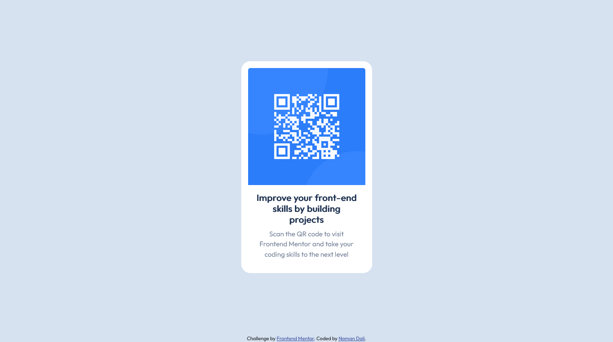

# Frontend Mentor - QR code component solution

## Table of contents

- [Overview](#overview)
  - [Screenshot](#screenshot)
  - [Links](#links)
- [My process](#my-process)
  - [Built with](#built-with)
  - [What I learned](#what-i-learned)
- [Author](#author)

## Overview

### Screenshot



### Links

- Solution URL: [Add solution URL here](https://noman-dali.github.io/challenge/)
- Live Site URL: [Add live site URL here](https://noman-dali.github.io/challenge/)

## My process

### Built with

- Semantic HTML5 markup
- CSS custom properties
- Flexbox
- CSS Grid
- Mobile-first workflow
- [Bootstrap 5.2 Framework](https://getbootstrap.com/) - For styles


### What I learned

The usage of the card component and how to style it.

To see how you can add code snippets, see below:

```html
  <div class="card" style="width: 18rem;">
    
    <div class="card-body">
      <h5 class="card-title">Improve your front-end skills by building projects</h5>
      <p class="card-text">Scan the QR code to visit Frontend Mentor and take your coding skills to the next level</p>
    </div>
  </div>
```

## Author

- Frontend Mentor - [@Noman-Dali](https://www.frontendmentor.io/profile/Noman-Dali)
